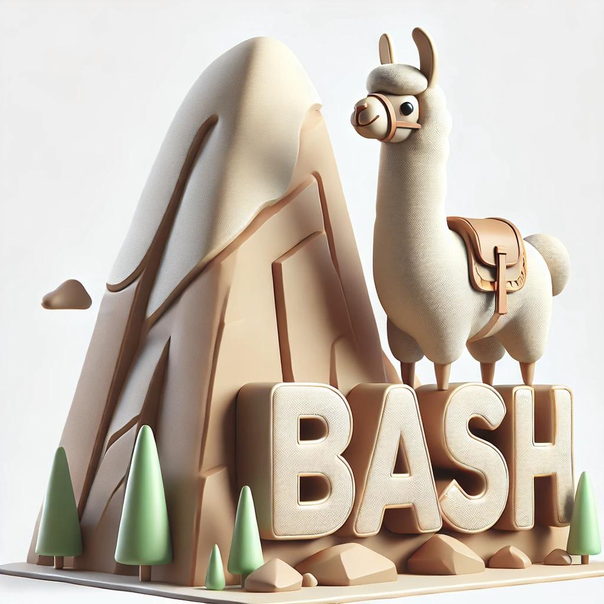

<div align="center">

# Sherpa

</div>

Tiny plugin for bash shell to autocomplete commands and model names in Ollama.

<div align="center">
  
</div>

## Content
- [Why this plugin?](#why-this-plugin)
- [Installation](#installation)
  - [System Installation](#system-installation)
  - [User Installation](#user-installation)
- [Usage](#usage)
- [Contributing](#contributing)
- [License](#license)


## Why this plugin?
Have you ever tried to use `ollama` commands and forgot the name of the model you wanted to use? Have you ever had to type again `ollama ps` to see the list of models you have? Save your time and follow the *tab flow* of Unix programs.

<div align="center">
  
</div>

## Installation
1. Clone this repository to your local machine:
```bash
git clone git@github.com:ehrlz/ollama-bash-completion-plugin.git
cd ollama-bash-completion-plugin
```

2. Make it executable:
```bash
chmod +x plugin.sh
```

>If you want to use it temporarily, you can run the following >command:
>```bash
>source plugin.sh
>```

3. Install the plugin. There are two ways to install the plugin: system-wide or user-specific.

### System Installation
1. For Ubuntu/Debian based systems, you can copy the `plugin.sh` file to `/etc/bash_completion.d/` directory:
```bash
sudo cp plugin.sh /etc/bash_completion.d/ollama
```
Optionally, you can source the script in your current shell session (it will be available for future sessions as well):
```bash
source /etc/bash_completion.d/ollama
```

2. Verify that the plugin is working by typing `ollama` and pressing the `Tab` key. You should see a list of available commands and model names.

### User Installation

1. Create a directory for your custom bash completion scripts:
```bash
mkdir -p ~/.bash_completion.d
```
2. Copy the `plugin.sh` file to the `~/.bash_completion.d/` directory:
```bash
cp plugin.sh ~/.bash_completion.d/ollama
```
3. Add the following line to your `~/.bashrc` or `~/.bash_profile` file:
```bash
# Load custom bash completions
if [ -d ~/.bash_completion.d/ ]; then
  for file in ~/.bash_completion.d/*; do
    source "$file"
  done
fi
```
4. Reload your shell configuration:
```bash
source ~/.bashrc
```

## Usage
Once you have installed the plugin, you can use it by typing `ollama` followed by a space and then pressing the `Tab` key. This will show you a list of available commands and model names.

> [!IMPORTANT]  
> `ollama` serve must be running in the background for the plugin to work.

Commands that are available for autocompletion:
  - `ollama`      General command
  - `run`         Run a model
  - `stop`        Stop a running model
  - `rm`          Remove a model
  - `show`        Show a model
  - `create`      Create a new model (completion for modelfile search)
  - `help`        Help about any command

> Ollama.com doesn't provide an API accessible list of available models to pull, so `ollama pull` is not available

> Command aliases (check each one in `ollama help`) are not available for autocompletion

## Contributing
If you want to contribute to this plugin, feel free to open an issue or a pull request. I will be happy to review it and merge it if it is useful.

## License
This plugin is licensed under the MIT License. See the [LICENSE](LICENSE) file for more information.
